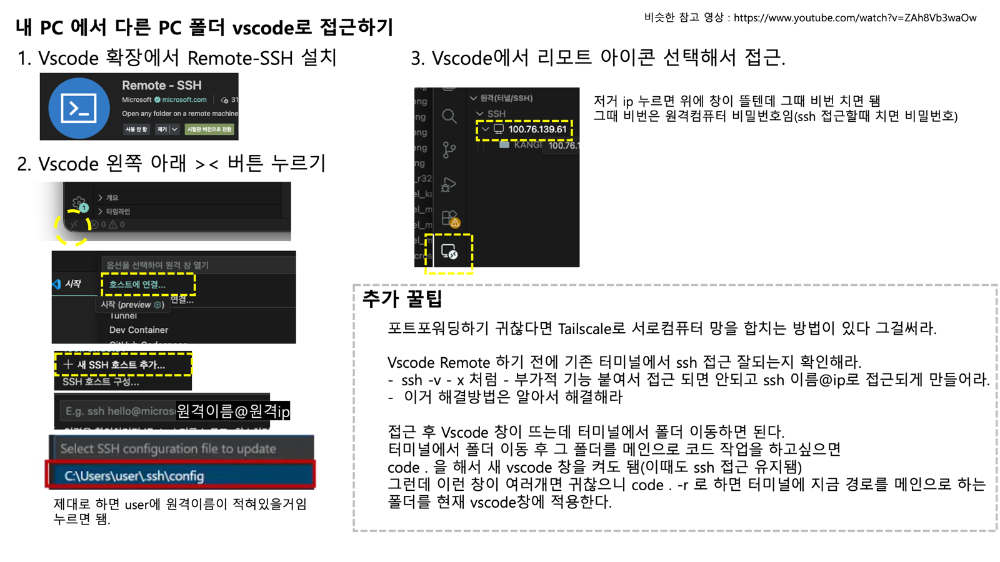

# TIP 

## 목차 (바로가기)
- [Vscode 원격 연결](#vscode_remote)
- [원격 pc 폴더 연결(마운트)](#samba)
- [Vscode-ColabServer 연동](#sec_vscode_colab)
- [Docker-Compose](#sec_docker_compose)

---

## Vscode 원격 연결

---

## 원격 pc 폴더 연동(마운트)

---

## Vscode-ColabServer연동

---

## Docker-Compose

